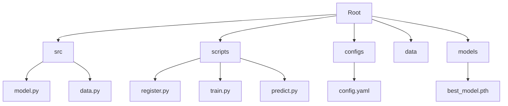

# 🐶 Chihuahua vs 🧁 Muffin Classification

A professional, data-centric deep learning project focused on the classic binary classification challenge. This repository implements a ResNet-18 architecture from scratch, integrated with **3LC** for advanced data visualization and curation.

## 🚀 Overview

This project aims to accurately distinguish between images of Chihuahuas and Muffins—a deceptively challenging task due to visual similarities in texture and color. Beyond simple classification, it employs a **data-centric AI workflow** using 3LC to identify mislabeled samples and analyze model embeddings.

### Key Features
- **ResNet-18 Architecture**: Custom classifier trained from scratch (no pre-trained weights) to comply with competition constraints.
- **3LC Integration**: Seamless data management, table registration, and performance monitoring.
- **Modular Design**: Clean separation of concerns between model architecture, data processing, and execution scripts.
- **Production-Ready Structure**: Organized into `src/`, `scripts/`, and `configs/` for scalability.

---

## 🏗️ Project Structure



- **`src/`**: Core library code (Model architecture, Data loading).
- **`scripts/`**: Entry point scripts for pipeline execution.
- **`configs/`**: Hyperparameters and project settings.
- **`models/`**: Serialized model weights.
- **`outputs/`**: Generated submissions and results.

---

## 🛠️ Setup & Installation

1. **Clone the repository**:
   ```bash
   git clone https://github.com/harveenkaur282-web/Chihuahua-vs-Muffin-Classification-3LC.git
   cd Chihuahua-vs-Muffin-Classification-3LC
   ```

2. **Install dependencies**:
   ```bash
   pip install -r requirements.txt
   ```

3. **Prepare Data**:
   Ensure your data is organized as follows:
   ```
   data/
   ├── train/ (chihuahua, muffin, undefined)
   ├── val/   (chihuahua, muffin)
   └── test/  (flat folder of images)
   ```

---

## 💻 Usage

### 1. Register Data Tables
Initialize 3LC tables for training and validation sets.
```bash
python scripts/register.py
```

### 2. Train Model
Launch the training pipeline (ResNet-18 from scratch).
```bash
python scripts/train.py
```

### 3. Generate Predictions
Generate a `submission.csv` for Kaggle using the best-performing checkpoint.
```bash
python scripts/predict.py
```

---

## 📊 Data-Centric AI with 3LC

This project utilizes [3LC](https://3lc.ai) to enhance the training workflow:
- **Interactive Dashboards**: Visualize the dataset and identify difficult-to-classify samples.
- **Embedding Analysis**: Project model features into 3D space to understand class separation.
- **Data Curation**: Refine labels and manage "undefined" samples directly from the UI.

---

## 📜 License
Distributed under the MIT License. See `LICENSE` for more information.
